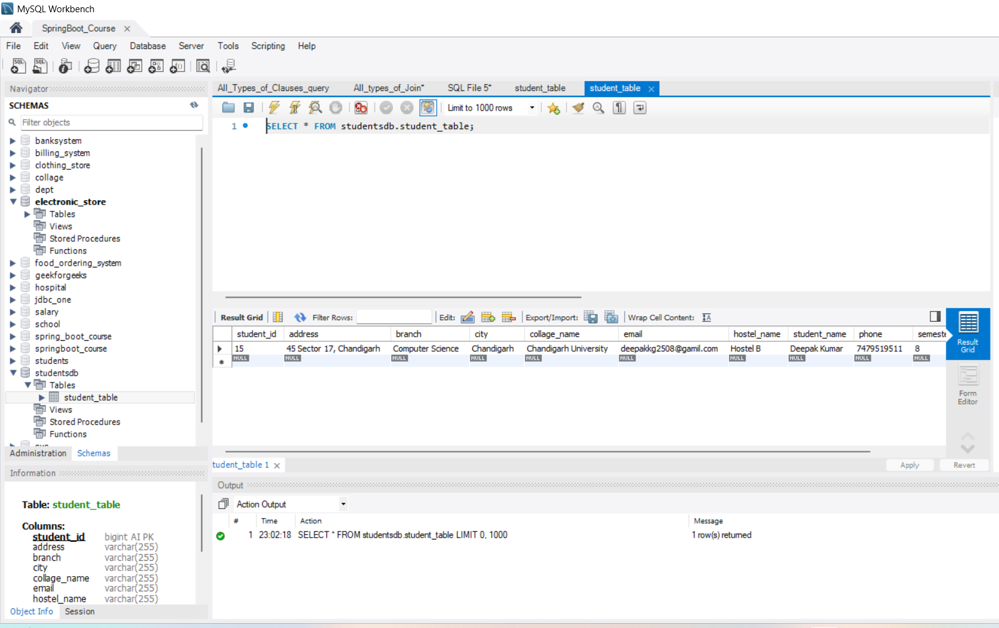

# 🎓 Student Management API

A RESTful API built with **Java, Spring Boot, and Spring Data JPA** for managing student records.  
This project demonstrates how to perform **CRUD operations** (Create, Read, Update, Delete) on student data with proper API endpoints, database integration, and clean architecture.

---

## 📌 Features
- Add new student records  
- Retrieve all students  
- Retrieve student by ID  
- Update student information  
- Partially update student fields  
- Delete student by ID  
- Delete all students  
- Integrated with **MySQL Database**  

---

## 🛠️ Tech Stack
- **Java 17+**  
- **Spring Boot**  
- **Spring Data JPA / Hibernate**  
- **MySQL**  
- **Postman** (for API testing)  
- **Maven**  

---

## 🚀 API Endpoints

| Method | Endpoint         | Description                  |
|--------|------------------|------------------------------|
| POST   | `/students`      | Add a new student            |
| GET    | `/students`      | Get all students             |
| GET    | `/students/{id}` | Get student by ID            |
| PUT    | `/students/{id}` | Update student (full)        |
| PATCH  | `/students/{id}` | Update student (partial)     |
| DELETE | `/students/{id}` | Delete student by ID         |
| DELETE | `/students`      | Delete all students          |

---

## 📂 Project Structure


---

## 🖼️ Project Outputs

### 1️⃣ Code Execution  
  
  

### 2️⃣ Postman API Testing  
- **Add Student**  
    

- **Get All Students**  
    

- **Get Student By ID**  
    

- **Delete Student**  
    

- **Update Student**  
    

- **Partial Update**  
    

- **Delete All Students**  
    

- **Get Students After Delete**  
    

### 3️⃣ Database Screenshot  
- **MySQL Database View**  
    

---

## ⚙️ Configure Database (MySQL)

Edit `src/main/resources/application.properties`:

```properties
spring.datasource.url=jdbc:mysql://localhost:3306/studentdb
spring.datasource.username=root
spring.datasource.password=your_password

spring.jpa.hibernate.ddl-auto=update
spring.jpa.show-sql=true
